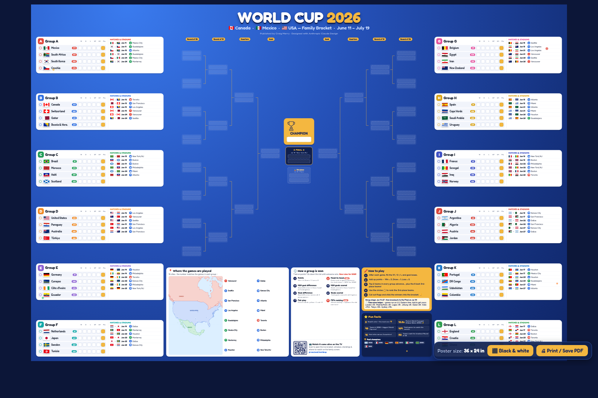
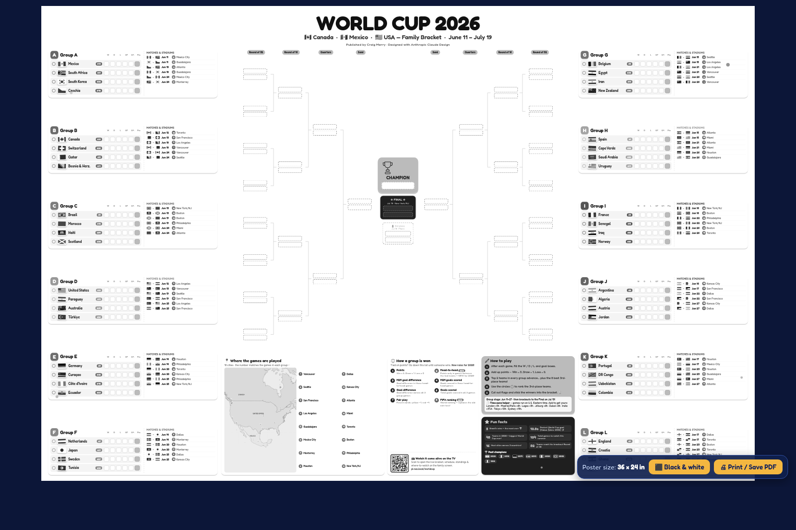
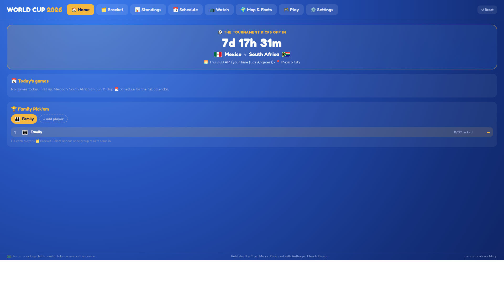
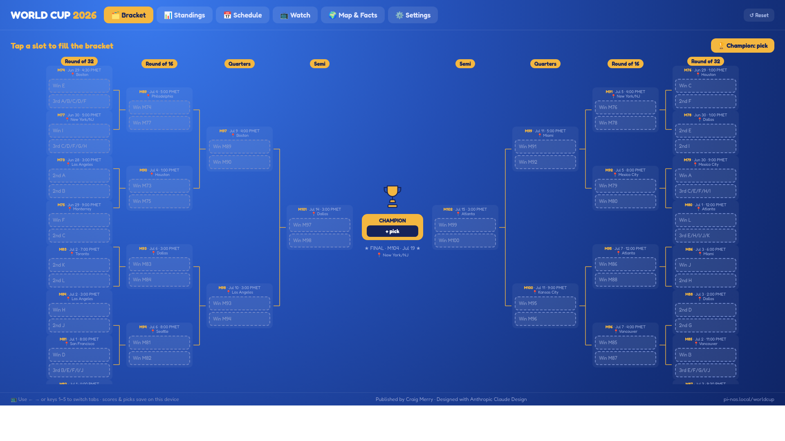
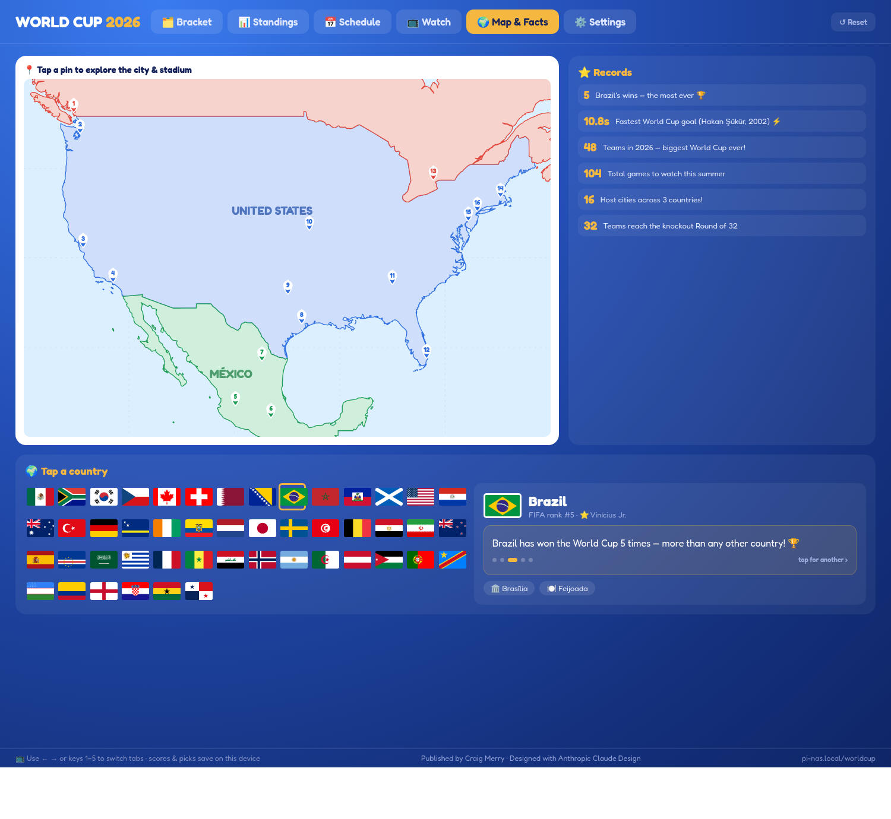
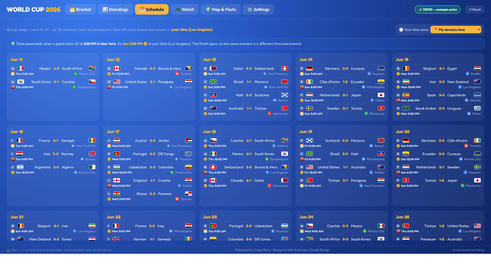
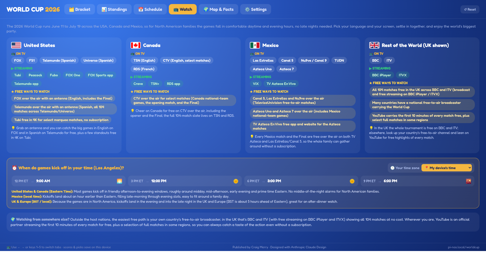
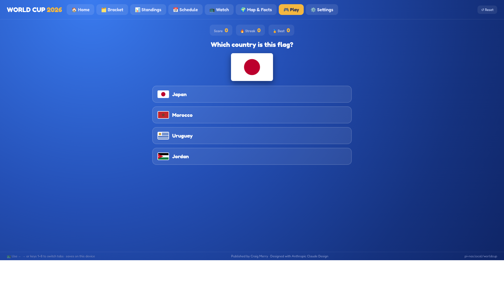
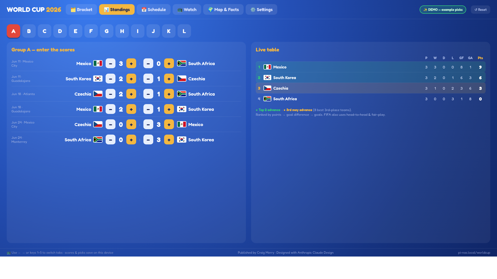
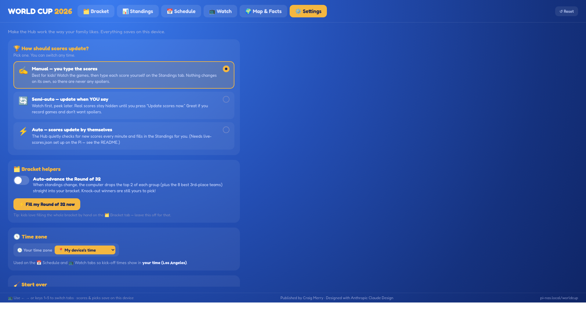

# 🏆 World Cup 2026 — Family Bracket & Hub

A two-part family kit for the **2026 FIFA World Cup** (June 11 – July 19, 2026 · hosted by 🇨🇦 Canada · 🇲🇽 Mexico · 🇺🇸 USA):

1. **🖨️ Print it** — a giant wall bracket, a print-at-home version, and cut-out flags you fill in by hand. **Color *or* black & white** for any printer.
2. **📺 Host it** — a self-contained interactive **Hub** you serve from any computer (a Raspberry Pi, an old laptop, anything) so the whole family can poke at it on the TV: fillable bracket, live-or-manual standings, a schedule **in your own time zone**, where-to-watch, rotating kid-friendly country facts, and a **🎟️ Panini sticker-album tracker** (mark Have/Need/doubles for all 980 stickers, then a **Trade Matcher** shows who can swap what).

The printed poster has a **QR code** that opens the Hub. Set it up once, and the bracket on your wall and the screen in your living room stay in sync with your family's picks.

> ▶ **Try it live (no setup):** **https://craigm26.github.io/WorldCup2026BracketForFamilies/**



> Everything is plain static HTML/JS — **no build step, no database, no account, no tracking.** Print what you want, host what you want, all from one folder.

---

## 🖨️ Option 1 — Print the bracket, info & flags

Open any of these in a browser and hit **Print / Save PDF**. Every one has a **⬛ Black & white** button in the corner — tap it for a clean, ink-light version that prints perfectly on a non-color (mono) printer.

| File | What it is | How to print |
|---|---|---|
| **World Cup 2026 Bracket.html** | The giant **36 × 24 in** wall poster — full knockout bracket (with every match's number, date, venue & feeders), all 12 groups, stadium map, fun facts, tiebreak rules, and the Hub QR code. A **Tweaks** panel lets you recolor it, retitle it, and set the QR link. | Open → (optional **⬛ Black & white**) → **Print / Save PDF** → take the PDF to any print/blueprint shop (engineering plotters do this size cheaply). |
| **Bracket - Print at Home.html** | The same bracket as **11 letter-size landscape pages** that tape together into a big wall display. | Open → (optional **⬛ Black & white**) → **Print** all 11 pages (landscape) on a normal printer → trim & tape. |
| **Flag Cutouts.html** | Sheets of all 48 team flags with dashed cut-lines — fill the bracket as teams advance. | Open → **Print** (color recommended) → make a few copies → cut along the dashed lines. |

| Color | Black & white (ink-saver) |
|---|---|
|  |  |

**Color or black & white?** Color looks great, but the dark poster uses a lot of ink/toner. The **⬛ Black & white** mode turns the sheet **white with grayscale art and dark text** — easy to read and far cheaper on any printer. The bracket, group tables, tiebreak rules, map, and facts all stay legible.

> **Time-zone helper for print:** the poster and print-at-home pages tell faraway family how to convert kick-off times from U.S. Eastern (e.g. London +5h, Tokyo +13h).

---

## 📺 Option 2 — Host the interactive Hub

The **Hub** is what the QR code opens — a touch/remote-friendly app for the TV or any phone. It has ten tabs:

| Tab | What it does |
|---|---|
| 🏠 **Home** | A live **countdown to the next kick-off** (in your time zone), today's games with a LIVE-now flag, your favorite team's next match, and the **Family Pick'em** leaderboard + player switcher. |
| 🗂️ **Bracket** | Tap any slot to drop in a team; crown a champion. Empty slots show their **feeders** ("Winner Group A", "Runner-up B", "3rd-place", "Winner of Match 74") and each match shows its **number, date & host city** — just like the wall chart. |
| 📊 **Standings** | Type scores (or let them fill automatically) — points, goal difference & 2026 tiebreakers update live. |
| 📅 **Schedule** | Every match with a **kick-off time in YOUR time zone**, a 🌞/🌙 **day-or-night** icon (so you know what's on past bedtime), and a kid-friendly time-zone lesson. |
| 📺 **Watch** | Where & how to watch in the US, Canada, Mexico & the rest of the world — including the **free** options — plus kick-off windows converted to your zone. |
| 🌍 **Map & Facts** | A spinnable **3D globe** of the whole planet with all **48 nations** highlighted — tap one for its **rotating kid-friendly facts** and ☆ Follow. Toggle to the host-city stadium map any time. (Falls back to a flag grid on devices without 3D.) |
| 🎮 **Play** | A flag / country / food **quiz game** for the kids — score, streak and best, with a fun fact after every answer. |
| 🎟️ **Stickers** | Track each family member's **Panini WC2026** album, laid out page-by-page by group with **every real player name** (all 980 stickers) — tap to mark Have / Need / doubles, tap **ⓘ** for a player's position, club & a fun fact, then the **Trade Matcher** shows exactly who can swap what — or add a sticker by its code. Each person can keep **more than one book** (e.g. a main album plus a "Swaps" book of duplicates); books are the unit of trading — the Trade Matcher works **book-to-book** and Family Sync shares **each book as its own entry**. |
| ❓ **Help** | Friendly, searchable **how-to cards** for every feature — how to fill the bracket, mark & trade stickers, find swaps, and set up family trading. Tap the small **❓** on a tab for the matching guide. |
| ⚙️ **Settings** | Choose how scores update — **Manual** (type your own, no spoilers), **Semi-auto** (update when *you* press the button), or **Auto** — plus an auto-fill-the-bracket helper and the time-zone picker. |

> **Family Pick'em:** add a player for each family member (Mom, Dad, each kid), and everyone keeps their own bracket. The Home leaderboard scores how many of the 32 qualifiers each person predicted — a friendly, spoiler-safe family competition that updates as real results come in.

> **Plus:** ⏰ an idle **screensaver / attract mode** (countdown, flags, facts & upcoming games — touch to wake); 📅 **add-to-calendar** (`.ics`) for the whole schedule or just your team's games; and 📤 **share your bracket by QR** — scan to open someone's exact picks on a phone. A kiosk can boot straight into auto-scores with `?scoremode=full`.

| Home — countdown & Pick'em | Bracket — with feeders | Map & Facts |
|---|---|---|
|  |  |  |
| **Schedule — your time zone** | **Watch — incl. free** | **Play — quiz game** |
|  |  |  |
| **Standings** | **Settings** | |
|  |  | |

> **Try the demo:** open the Hub with `?demo=1` (e.g. `index.html?demo=1`) to see a fully-filled example bracket and standings. Add `&tab=facts` to jump straight to a tab.

### 👨‍👩‍👧 Family Sync (trade stickers with relatives far away) — optional

Stickers can be shared across households with a free Google Sheet as the backend. The Hub
works fully without this — it's opt-in.

1. Create a Google Sheet. **Extensions → Apps Script**, paste `worldcup/family-sync.gs`, Save.
2. **Deploy → New deployment → Web app** — *Execute as: Me*, *Who has access: Anyone* — Deploy, and copy the **/exec URL**.
3. Pick a **family code** (any word). Share this one link with relatives (a QR works too):
   `https://<your-hub>/worldcup/?sync=<EXEC_URL>&code=<FAMILY_CODE>`
4. Each person opens the link once on their phone, creates their player, taps **Publish my
   collection**, and can propose trades on the **🎟️ Stickers → 👨‍👩‍👧 Family** tab.

> Each device publishes its **active** player's books — one shared entry per book — if several people share one device, switch player (🏠 Home) before publishing.

> Security: the endpoint is gated only by the family code — anyone with the link can read/write
> your family's sticker data, so don't post it publicly. Data lives in your private Sheet
> (names + sticker counts only). The `/exec` URL is a secret — never commit it.

### ▶ Run it on your own computer (Mac / Windows / Linux)

No Raspberry Pi required:

1. **Download** this project (green **Code → Download ZIP** on GitHub) and unzip it.
2. **Double-click** your launcher: `start.command` (Mac), `start.bat` (Windows), or `start.sh` (Linux).
   It uses Python or Node (whichever you already have) to serve the Hub and opens your browser.
3. The Hub opens at `http://localhost:8080/worldcup/`.

Prefer Docker? `docker build -t worldcup . && docker run --rm -p 8080:8080 worldcup`, then open `localhost:8080/worldcup/`.

**Family Sync setup:** open **`setup.html`** (in this project, or at the hosted site) for a guided, ~5-minute helper that writes your shareable family link for you.

### Quick deploy (any web server)

The Hub is **plain static files**. To serve it at `http://<your-host>/worldcup/`:

```bash
# copy the worldcup/ folder into your web root, e.g. for nginx/Apache/Caddy:
scp -r worldcup you@your-host:/var/www/html/
```

Then visit `http://<your-host>/worldcup/`. That's it — `index.html` inside the folder *is* the Hub.

**No web server yet?** The simplest option (one binary, auto-starts on boot):

```bash
sudo apt install caddy
echo "your-host.local {
    root * /var/www/html
    file_server
}" | sudo tee /etc/caddy/Caddyfile
sudo systemctl restart caddy
```

…or for a quick test with nothing to install: `cd /var/www/html && python3 -m http.server 80`.

### 🌐 Make it work offline (recommended for a living-room TV)

By default the Hub loads React, the map, fonts, and flags from the internet. To make it run **with zero internet** — robust on a flaky connection, and cheap to set up anywhere — run this **once while the host still has internet**:

```bash
cd /var/www/html/worldcup
bash make-offline.sh
```

It downloads every library, the map geometry, all 48 flags, **and the Fredoka font** into local folders and rewrites the HTML to use them (originals saved as `*.html.bak`). After that the Hub runs fully offline. *(Only genuinely live data — optional live scores — ever touches the network.)*

### 🔗 Add the Hub to your home page

Open **`worldcup/home-page-card.html`**, copy the snippet, and paste it into your family home page next to your other cards. It's a self-contained button that links to `/worldcup/`. (On the Merry household Pi-NAS, the home page also shows a QR card so anyone can scan straight to it.)

### 📱 Point the poster's QR code at your Hub

The poster's QR defaults to `http://pi-nas.local/worldcup`. If your address is different, open **World Cup 2026 Bracket.html**, turn on **Tweaks**, edit **"QR / NAS link"**, and re-print.

### 📺 Kiosk mode (TV boots straight into the Hub)

```bash
chromium --kiosk --noerrdialogs --disable-infobars "http://<your-host>/worldcup/"
```

Navigate with **← →** arrow keys or number keys **1–6**, or any remote/air-mouse.

---

## ⚙️ Optional extras

### Live scores
The Hub auto-fills standings & the schedule from a `live-scores.json` file next to `index.html`. A ready-to-use updater is included — **`update_scores.py`** (needs a free [football-data.org](https://www.football-data.org/client/register) token, kept in an environment variable, never committed). See the script header. With **Settings → Semi-auto**, scores stay hidden until you press *Update now* — perfect if you record games and hate spoilers.

### Customizing
- **Teams / groups / fixtures / facts:** `worldcup/data.js`
- **Knockout bracket (venues, dates, feeders):** `worldcup/data.js` (`KO_M` / `KO_LAYOUT`)
- **Where-to-watch channels & kick-off windows:** `worldcup/hub-data.js`
- **Time zones offered in the picker:** `worldcup/hub-data.js` (`WCTZ.ZONES`)
- **Poster look** (theme, accent, tagline, QR link, show/hide panels): the **Tweaks** panel on the poster.

The groups & fixtures follow the official 2026 draw/schedule; the knockout skeleton (match #, venue, date, ET kick-off, and which group-finisher feeds each slot) is the official, published bracket — the *teams* fill in as the tournament is played. Edit `data.js` to adjust anything.

---

## 📁 What's in the kit

```
worldcup/
  index.html                  ← the interactive Hub (open this / deploy this)
  World Cup 2026 Bracket.html  ← 36×24" poster (color + B&W)
  Bracket - Print at Home.html ← 11-page tape-together bracket (color + B&W)
  Flag Cutouts.html            ← printable flags
  home-page-card.html          ← copy-paste card for your home page
  data.js  hub-data.js  *.jsx  ← teams, fixtures, knockout, facts, time zones, components
  make-offline.sh              ← vendor everything for offline use
  update_scores.py             ← optional live-scores updater
  live-scores.example.json     ← live-scores format
```

---

*Published by **Craig Merry** · Designed with **Anthropic Claude** Design.*
*A family project — print it, host it, and enjoy the tournament! ⚽*
